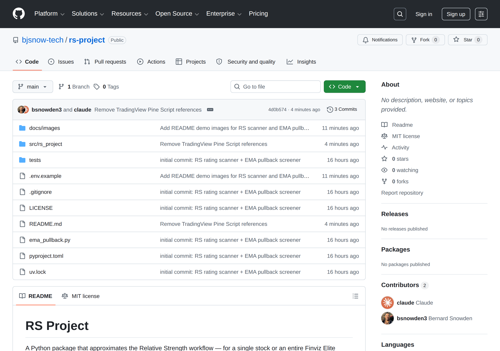
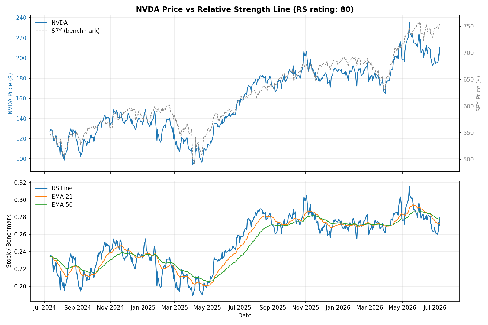
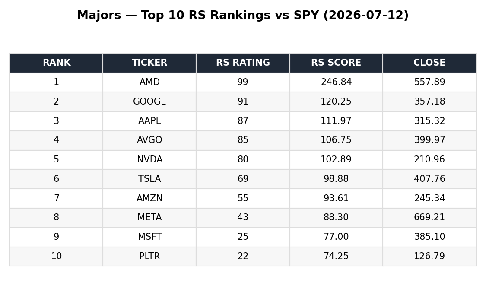
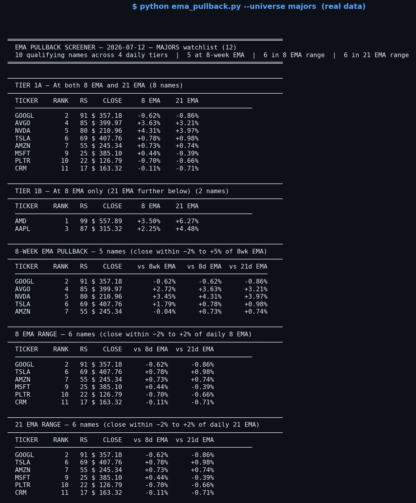
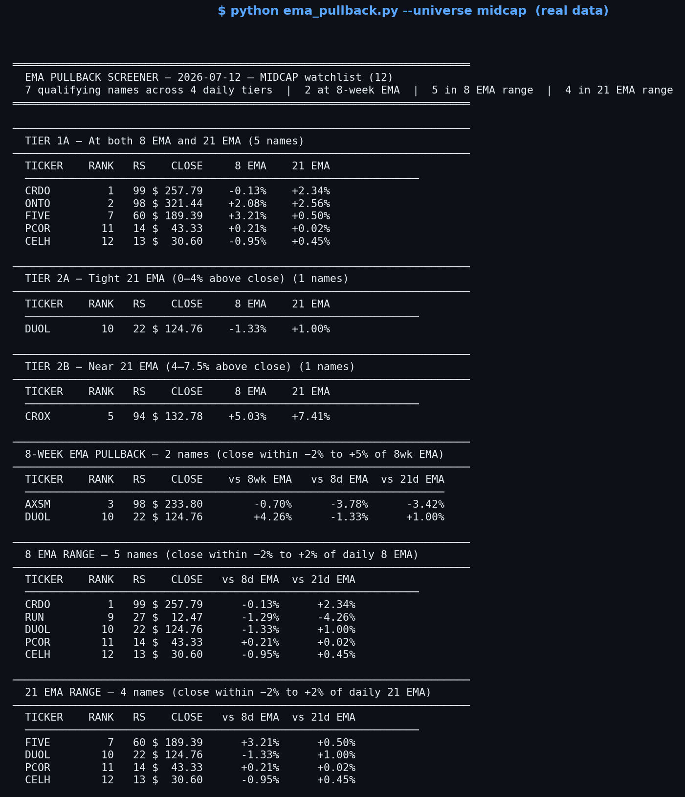
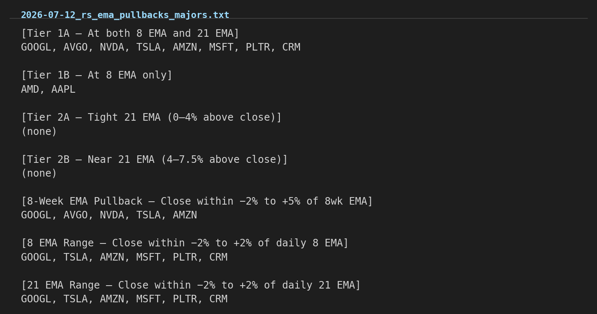
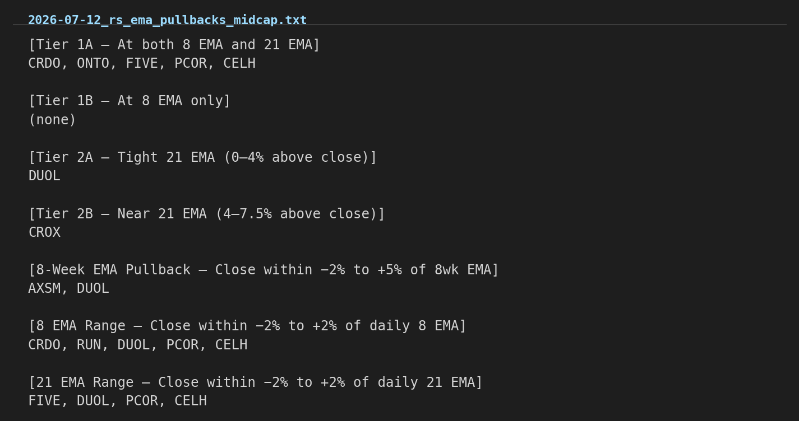
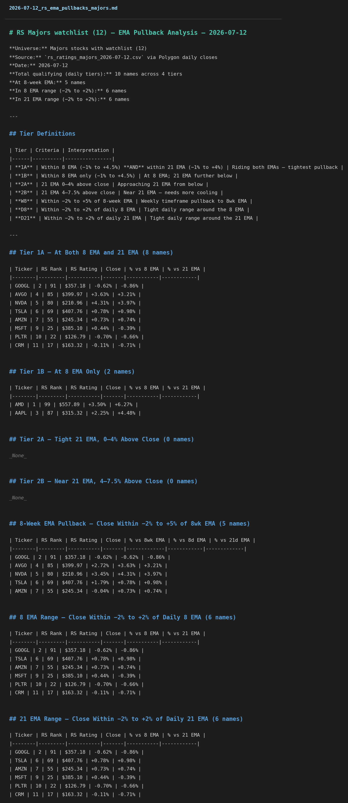

# RS Project

A Python package that approximates the Relative Strength workflow — for a single stock or an entire Finviz Elite universe.



## Features

- Downloads daily price data via Polygon
- Computes the RS line as `stock / benchmark`
- Computes a weighted 12-month RS score using 63, 126, 189, and 252 trading-day lookbacks
- Maps the score to an approximate 1-99 RS rating using replay-mode threshold bands
- **Universe mode**: fetch a ticker list from any Finviz Elite export URL, compute RS ratings in parallel, and print a ranked leaderboard
- **Daily mode**: rank stocks by single-day return relative to a benchmark
- **Cap tier modes**: dedicated flags for small caps, mid caps, and majors — each saves results to its own folder
- Optional matplotlib plot of the RS line with two moving average overlays

## Demo

RS line with EMA overlays (`rs-rating NVDA --plot`):



Universe leaderboard (`rs-rating --majors`):



EMA pullback screener — majors (`python ema_pullback.py --universe majors`):



EMA pullback screener — midcap (`python ema_pullback.py --universe midcap`):



`--save-insights` ticker list output — majors:



`--save-insights` ticker list output — midcap:



`--save-insights` markdown report output — majors:



*(Generated from real market data via Yahoo Finance, using this project's own RS scoring and EMA pullback tier-classification logic.)*

## Project layout

```text
rs_project/
├── .env
├── README.md
├── pyproject.toml
├── ema_pullback.py       ← EMA pullback screener (see below)
├── results/
│   ├── smallcap/    ← rs_ratings_YYYY-MM-DD.csv, daily_rs_YYYY-MM-DD.csv
│   ├── midcap/      ← rs_ratings_YYYY-MM-DD.csv, daily_rs_YYYY-MM-DD.csv
│   └── majors/      ← rs_ratings_YYYY-MM-DD.csv, daily_rs_YYYY-MM-DD.csv
├── src/
│   └── rs_project/
│       ├── __init__.py
│       ├── cli.py       ← entry point
│       ├── core.py      ← RS computation logic
│       └── plotting.py  ← optional chart
└── tests/
    └── test_core.py
```

## Install

```bash
python -m venv .venv
source .venv/bin/activate
pip install -e .
```

Or with [uv](https://github.com/astral-sh/uv):

```bash
uv sync
```

## Configuration

Add the following to your `.env` file:

| Variable | Required | Description |
|---|---|---|
| `POLYGON_API_KEY` | Yes | Polygon.io API key for price data |
| `FINVIZ_AUTH_TOKEN` | For universe/daily scans | The `auth=` token from any Finviz Elite export URL |
| `FINVIZ_URL` | Optional | Default universe URL (mid cap and above) |
| `FINVIZ_SMALLCAP_URL` | Optional | Small cap universe ($300M–$2B) |
| `FINVIZ_MIDCAP_URL` | Optional | Mid cap universe ($2B–$10B) |
| `FINVIZ_MAJORS_URL` | Optional | Large/mega cap universe ($10B+) |

Example `.env`:

```bash
POLYGON_API_KEY=your_key_here
FINVIZ_AUTH_TOKEN=your_token_here
FINVIZ_URL=https://elite.finviz.com/export.ashx?v=111&f=cap_midover,exch_nyse|nasd|cboe&auth={token}
FINVIZ_SMALLCAP_URL=https://elite.finviz.com/export.ashx?v=111&f=cap_small,exch_nyse|nasd|cboe&auth={token}
FINVIZ_MIDCAP_URL=https://elite.finviz.com/export.ashx?v=111&f=cap_mid,exch_nyse|nasd|cboe&auth={token}
FINVIZ_MAJORS_URL=https://elite.finviz.com/export.ashx?v=111&f=cap_largeover,exch_nyse|nasd|cboe&auth={token}
```

## Usage

### Single ticker

```bash
rs-rating AAPL
rs-rating NVDA --plot
rs-rating ANET --benchmark ^GSPC --period 3y --plot
```

### RS ratings by cap tier

Each command fetches tickers from the corresponding Finviz URL, computes RS ratings in parallel, and saves a CSV to the matching results folder. Benchmark defaults are set automatically per tier.

```bash
# Small caps ($300M–$2B) — benchmark: IWM → results/smallcap/
rs-rating --small-cap

# Mid caps ($2B–$10B) — benchmark: MDY → results/midcap/
rs-rating --mid-cap

# Large/mega caps ($10B+) — benchmark: SPY → results/majors/
rs-rating --majors
```

Filter and sort options apply to all cap tier modes:

```bash
# Top 25 small caps by RS rating
rs-rating --small-cap --top 25

# Mid caps with RS rating >= 80, sorted by score
rs-rating --mid-cap --min-rating 80 --sort score

# Top 50 majors with extra parallelism
rs-rating --majors --top 50 --workers 16
```

### Daily outperformers by cap tier

Ranks stocks by their single-day return relative to the benchmark. All three tiers use SPY as the daily benchmark by default.

```bash
# Small cap daily outperformers vs SPY → results/smallcap/
rs-rating --small-cap --daily

# Mid cap daily outperformers vs SPY → results/midcap/
rs-rating --mid-cap --daily

# Majors daily outperformers vs SPY → results/majors/
rs-rating --majors --daily
```

Common daily mode options:

```bash
# Top 25 small cap outperformers today
rs-rating --small-cap --daily --top 25

# Top 20 majors for a specific date
rs-rating --majors --daily --top 20 --date 2026-04-18

# Mid caps vs QQQ instead of SPY
rs-rating --mid-cap --daily --benchmark QQQ
```

### Custom Finviz URL

Pass any Finviz Elite `export.ashx` URL directly. The `{token}` placeholder is filled from `FINVIZ_AUTH_TOKEN`.

```bash
rs-rating --finviz-url "https://elite.finviz.com/export.ashx?v=111&f=...&auth={token}"
rs-rating --finviz-url "..." --top 20 --min-rating 90 --sort score
```

### All options

```
rs-rating --help
```

## Output

Results are saved as CSV files. Cap tier modes route automatically:

| Mode | Output path |
|---|---|
| `--small-cap` | `results/smallcap/rs_ratings_smallcap_YYYY-MM-DD.csv` |
| `--small-cap --daily` | `results/smallcap/daily_rs_smallcap_YYYY-MM-DD.csv` |
| `--mid-cap` | `results/midcap/rs_ratings_midcap_YYYY-MM-DD.csv` |
| `--mid-cap --daily` | `results/midcap/daily_rs_midcap_YYYY-MM-DD.csv` |
| `--majors` | `results/majors/rs_ratings_majors_YYYY-MM-DD.csv` |
| `--majors --daily` | `results/majors/daily_rs_majors_YYYY-MM-DD.csv` |

Use `--output FILE` to override the path, or `--no-csv` to skip saving.

## EMA pullback screener

`ema_pullback.py` reads the RS ratings CSV for a given date/universe (produced by `rs-rating`
above), fetches daily and weekly closes from Polygon for those tickers, computes 8/21-day and
8-week EMAs, and classifies each stock into pullback tiers (e.g. `1A` = within both the 8 and 21
daily EMA bands, `W8` = within the 8-week EMA band). It's meant to run after a cap-tier `rs-rating`
scan, as a second pass to find RS leaders currently sitting near a moving-average pullback entry.

```bash
python ema_pullback.py --universe majors
python ema_pullback.py --universe smallcap --date 2026-04-18 --top 30
```

Run `python ema_pullback.py --help` for the full option list.

## Notes

This is an approximation of the Relative Strength logic, not an exact clone of an official IBD RS Rating.
The original approach uses external seeded threshold data; this project uses replay-mode thresholds as fixed cutoffs.

## License

MIT — see [LICENSE](LICENSE).
